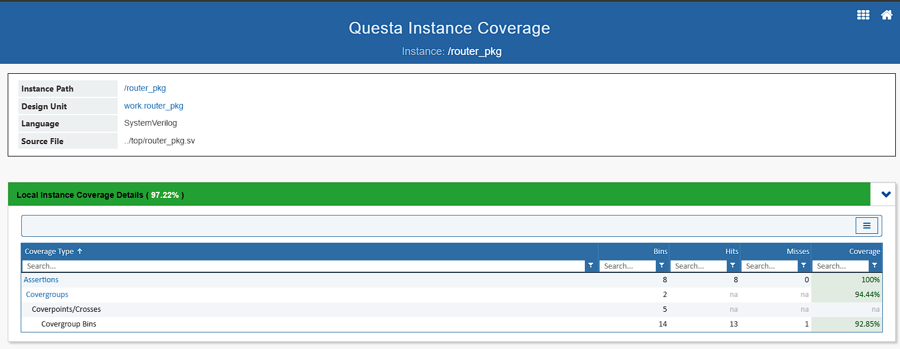

# 1×3 Router — SystemVerilog RTL & UVM Verification

## Overview

This project implements and verifies a **1×3 packet-based router** using SystemVerilog RTL and a **UVM-based functional verification environment**.

The router accepts packets through a single source interface and routes each packet to one of three destination FIFOs according to the **2-bit destination address** encoded in the packet header. The verification environment drives packets at the source, controls reads at the selected destination, monitors both sides, compares transmitted and received packet contents, and collects functional/code coverage using Questa/ModelSim.

The project is organized as a conventional RTL + UVM verification environment and includes reusable agents, configuration objects, sequences, a virtual sequencer, monitors, drivers, a scoreboard, and coverage collection.

---

## Design Features

- Single input/source interface.
- Three independent output/destination interfaces.
- Packet routing based on the 2-bit address field in the packet header.
- Three output FIFOs.
- FIFO status handling (`empty`/`full`).
- Router FSM for packet reception, transfer, and parity handling.
- Packet parity generation/checking.
- Error indication through the router `err` output.
- Busy indication through the router `busy` output.
- Destination-side soft reset support for individual FIFOs.
- Synchronous clocked RTL design.

### Packet Format

The packet header is 8 bits wide:

```text
  7                         2 1       0
 +---------------------------+---------+
 |      Payload Length       | Address |
 +---------------------------+---------+
        6 bits                  2 bits
```

- `header[7:2]` — payload length.
- `header[1:0]` — destination address.
- `2'b00` — destination 0.
- `2'b01` — destination 1.
- `2'b10` — destination 2.
- `2'b11` — reserved/invalid and constrained out of the generated transactions.

The payload contains the number of bytes specified by `header[7:2]`. A parity byte follows the payload.

The verification transaction calculates parity as the XOR of the header and every payload byte.

---

## RTL Architecture

The top-level DUT is `router_top`.

```text
                         +-------------------+
 source interface -----> |                   |
 pkt_valid               |    router_top     |
 data_in                 |                   |
 resetn                  |  +-------------+  |
                         |  |     FSM     |  |
                         |  +-------------+  |
                         |        |          |
                         |  +-------------+  |
                         |  | Synchronizer|  |
                         |  +-------------+  |
                         |        |          |
                         |  +-------------+  |
                         |  |  Register   |  |
                         |  +-------------+  |
                         |        |          |
                         |  +------+------+ |
                         |  |      |      | |
                         | FIFO0  FIFO1  FIFO2
                         +--+------+------+--+
                            |      |      |
                            v      v      v
                         dest0   dest1   dest2
```

### RTL modules

| File | Description |
|---|---|
| `rtl/router_top.v` | Top-level 1×3 router integrating the internal blocks |
| `rtl/fsm.v` | Router control/state machine |
| `rtl/fifo.v` | Destination FIFO implementation |
| `rtl/register.v` | Packet/data register logic |
| `rtl/synchronizer.v` | Destination selection, FIFO status and output-control logic |
| `rtl/source_if.sv` | Source-side interface definition |
| `rtl/dest_if.sv` | Destination-side interface definition |

---

## UVM Verification Architecture

The testbench uses one active source agent and three active destination agents.

```text
                         +----------------+
                         |    UVM Test    |
                         +-------+--------+
                                 |
                         +-------v--------+
                         |      env       |
                         +---+--------+---+
                             |        |
                  +----------+        +----------+
                  |                           |
          +-------v--------+          +-------v--------+
          | source_agent_top|          | dest_agent_top |
          +-------+--------+          +---+---+---+-----+
                  |                       |   |   |
             Source Agent             D0  D1  D2 agents
             +---------+              |   |   |
             | drv     |              drv drv drv
             | mon     |              mon mon mon
             | seqr    |              seqr seqr seqr
             +---------+              |   |   |
                  |                   +---+---+---+
                  |                       |
                  +----------+------------+
                             |
                     +-------v--------+
                     |   Scoreboard   |
                     | + Coverage     |
                     +----------------+
```

### Source agent

The source agent contains:

- `source_drv` — drives packet transactions into the DUT.
- `source_mon` — reconstructs packets from the source interface.
- `source_sequencer` — supplies transactions to the driver.
- `source_config` — stores source virtual-interface/configuration information.
- `source_agent` / `source_agent_top` — agent hierarchy.

### Destination agents

Three destination agents model the three router outputs. Each contains:

- `dest_drv` — waits for `valid_out`, applies a programmable read delay, and asserts `read_en`.
- `dest_mon` — reconstructs the packet read from the destination FIFO.
- `dest_sequencer` — supplies destination timing transactions.
- `dest_config` — stores destination virtual-interface/configuration information.
- `dest_agent` / `dest_agent_top` — agent hierarchy.

### Virtual sequencer

The virtual sequencer coordinates the source and destination sequencers so that a source packet and the corresponding destination read operation execute concurrently.

The destination selected for a test is chosen using a randomized address value constrained to `0`, `1`, or `2`.

---

## Transaction Generation

### Source transaction

`source_trans` contains:

- 8-bit header.
- Dynamic payload array.
- 8-bit parity.
- Router status fields such as `busy` and `err`.

Constraints enforce:

- Destination address is not `2'b11`.
- Payload length equals `header[7:2]`.
- Payload length is non-zero.

The source transaction calculates parity in `post_randomize()`:

```text
parity = header XOR payload[0] XOR payload[1] XOR ...
```

### Destination transaction

`dest_trans` contains the received packet fields and a randomized read delay.

The destination delay classes are:

| Sequence | Delay |
|---|---:|
| `less_delay_seqs` | 1–15 cycles |
| `medium_delay_seqs` | 16–30 cycles |
| `large_delay_seqs` | 40 cycles |

---

## Test Scenarios

The test classes are defined in `test/base_test.sv` and exercise different packet sizes and destination-read delays.

| Test | Packet size | Destination delay |
|---|---|---|
| `short_test` | 1–14 bytes | 1–15 cycles |
| `medium_test` | 21–40 bytes | 16–30 cycles |
| `large_less` | 41–63 bytes | 1–15 cycles |
| `large_test` | 41–63 bytes | 40 cycles |

The packet address is randomized using a cyclic random variable (`randc`) and is constrained to the three valid destinations.

---

## Scoreboard and Checking

The scoreboard receives transactions from:

- The source monitor through `source_fifo`.
- Each destination monitor through one of three destination analysis FIFOs.

The received packet is compared against the transmitted packet for:

1. Header equality.
2. Payload equality.
3. Parity equality.

Successful checks produce UVM informational messages such as:

```text
Header PASSED
Payload PASSED
Parity match successful
```

Mismatches are reported as UVM errors.

> **Important:** The included simulation logs show that `test1`–`test4` completed with zero UVM errors/fatals, while the included `test5.log` contains three scoreboard errors (header, payload and parity). Therefore, the supplied regression artifacts should not be described as a completely passing regression. The failure should be investigated before using this repository as a final sign-off baseline.

---

## Functional Coverage

The scoreboard contains functional coverage for source and destination transactions.

### Address coverage

Three bins cover the valid destination addresses:

- Address 0
- Address 1
- Address 2

### Payload-length coverage

The coverage model contains three packet-size classes:

- Small: 1–14 bytes.
- Medium: 21–40 bytes.
- Large: 41–63 bytes.

### Source error coverage

The source coverage model also records:

- `err = 0`
- `err = 1`

### Code coverage

The Makefile enables Questa coverage options including code coverage, assertions/directives, and coverage database generation. A merged HTML coverage report can be generated from the individual test coverage databases.

---

## Directory Structure

```text
Router1x3 - Copy/
├── rtl/
│   ├── router_top.v
│   ├── fifo.v
│   ├── fsm.v
│   ├── register.v
│   ├── synchronizer.v
│   ├── source_if.sv
│   └── dest_if.sv
│
├── source/
│   ├── source_trans.sv
│   ├── source_config.sv
│   ├── source_drv.sv
│   ├── source_mon.sv
│   ├── source_seqs.sv
│   ├── source_sequencer.sv
│   ├── source_agent.sv
│   └── source_agent_top.sv
│
├── destination/
│   ├── dest_trans.sv
│   ├── dest_config.sv
│   ├── dest_drv.sv
│   ├── dest_mon.sv
│   ├── dest_seqs.sv
│   ├── dest_sequencer.sv
│   ├── dest_agent.sv
│   └── dest_agent_top.sv
│
├── tb/
│   ├── env.sv
│   ├── env_config.sv
│   ├── virtual_sequencer.sv
│   ├── virtual_seqs.sv
│   └── scoreboard.sv
│
├── test/
│   └── base_test.sv
│
├── top/
│   ├── top.sv
│   └── router_pkg.sv
│
└── sim/
    ├── Makefile
    ├── test1.log ... test5.log
    ├── mem_cov*
    └── covhtmlreport/
```

The `sim/work`, `covhtmlreport`, coverage databases, simulator logs, and waveform databases are generated/simulator artifacts rather than source files required to understand the RTL architecture.

---

## Coverage Results

The UVM verification environment was evaluated using Questa coverage analysis. The reported results are:

| Coverage Metric | Result |
|---|---:|
| Instance Coverage | **97.22%** |
| Design Units Coverage | **97.22%** |
| Assertions | **100%** |
| Covergroups | **94.44%** |
| Covergroup Bins | **92.85%** |

<p align="center">
  
</p>

<p align="center">
  <b>Figure 2: Functional and Assertion Coverage Results</b>
</p>

## Requirements

The Makefile is configured primarily for:

- **Siemens Questa / ModelSim** for simulation and coverage.
- **Synopsys VCS** as an alternative simulator.
- **SystemVerilog**.
- **UVM**.

For Questa, the environment must provide commands such as:

```text
vlib
vmap
vlog
vsim
vcover
```

For VCS, the environment must provide:

```text
vcs
simv
urg
verdi
```

The VCS section also contains a site-specific Verdi PLI path. This path will need to be changed for a different installation.

---

## Running with Questa

Change into the simulation directory:

```bash
cd sim
```

Display the available Makefile targets:

```bash
make help
```

Compile the RTL and UVM testbench:

```bash
make sv_cmp
```

Run the short-packet test:

```bash
make run_test1
```

Run the medium-packet test:

```bash
make run_test2
```

Run the large-packet/short-delay test:

```bash
make run_test3
```

Run the large-packet/large-delay test:

```bash
make run_test4
```

Run the complete regression and merge coverage:

```bash
make regress
```

Generate/merge the coverage report separately:

```bash
make report
```

Open the HTML coverage report:

```bash
make cov
```

> The Makefile's `run_test` target is also available and invokes `+UVM_TESTNAME=short_test`; `run_test1` is likewise configured for `short_test`. Check the Makefile if you modify the test mapping, since the target names and test names are not perfectly one-to-one.

---

## Running a Test Directly

After compilation, a UVM test can be selected with `+UVM_TESTNAME`.

For example:

```bash
vsim work.top +UVM_TESTNAME=medium_test
```

Available test names in the current source are:

```text
short_test
medium_test
large_less
large_test
```

---

## Waveform Viewing

The Makefile generates WLF waveform databases for Questa runs.

Examples:

```bash
make view_wave1
make view_wave2
make view_wave3
make view_wave4
make view_wave5
```

These targets invoke Questa in waveform-viewing mode on the corresponding WLF file.

---

## Coverage Flow

Each regression test saves an individual coverage database:

```text
mem_cov1
mem_cov2
mem_cov3
mem_cov4
mem_cov5
```

The `report` target merges the databases:

```text
mem_cov
```

and generates an HTML report under:

```text
covhtmlreport/
```

The repository already contains a generated coverage-report directory from a previous simulation run.

---

## Verification Flow

A typical transaction proceeds as follows:

1. The base test creates the environment configuration.
2. A valid destination address (`0`, `1`, or `2`) is randomized.
3. The same address is provided to the source and destination virtual sequences.
4. A source sequence generates a constrained-random packet.
5. The source driver waits for `busy` to deassert and drives the header/payload/parity.
6. The router decodes the destination address and stores the packet in the corresponding FIFO.
7. The destination driver waits for `valid_out`.
8. The destination driver waits for the selected delay interval and asserts `read_en`.
9. The destination monitor reconstructs the output packet.
10. The scoreboard compares source and destination transactions.
11. Functional coverage is sampled for the observed transactions.
12. Questa saves the coverage database when the test exits.


---

## Notes and Potential Improvements

  Several areas could be strengthened for a production-quality verification environment:

- Investigate the `large_test` failure observed in `test5.log`.
- Improve scoreboard transaction matching so that multiple outstanding transactions can be handled robustly rather than relying on the first destination FIFO that returns data.
- Add explicit assertions for protocol rules such as packet-valid timing, FIFO overflow/underflow prevention, and destination routing.
- Add coverage crosses between destination address, packet length, delay class, and error/parity conditions.
- Add negative/error-injection tests for parity failures and invalid addresses.
- Add tests for FIFO-full and FIFO-empty boundary conditions.
- Add reset tests during different router operating states.
- Clean up generated simulator artifacts from source control and retain only reproducible source/configuration files where appropriate.
- Make the simulator/test target naming in the Makefile consistent with the actual UVM test names.

---

## Tools and Technologies

- SystemVerilog
- UVM
- Questa / ModelSim
- Synopsys VCS support
- Verdi support for VCS waveform/debug flow
- Functional coverage
- Code coverage
- Constrained-random verification
- UVM agents, drivers, monitors, sequencers and virtual sequencer
- Transaction-level scoreboard checking

---

## Project Purpose

This project demonstrates an end-to-end RTL verification methodology for a packet router, including DUT modeling, interface abstraction, constrained-random stimulus, synchronized source/destination operation, transaction monitoring, scoreboard-based checking, and coverage-driven verification.

It can be used as a reference project for learning or demonstrating **SystemVerilog RTL design and UVM functional verification**.
